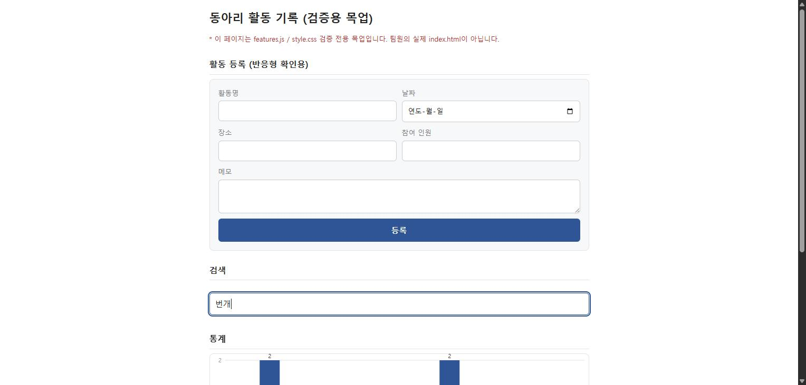
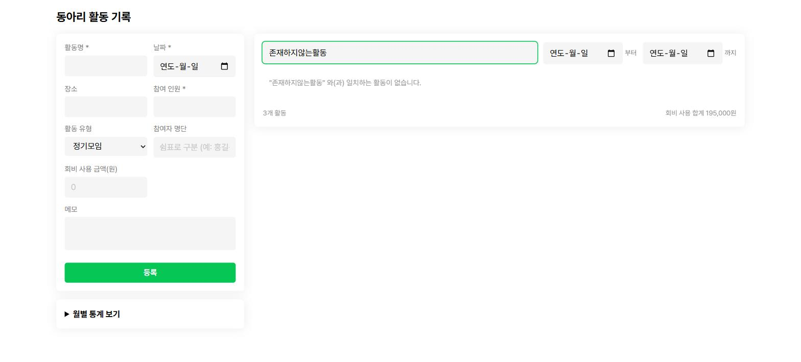
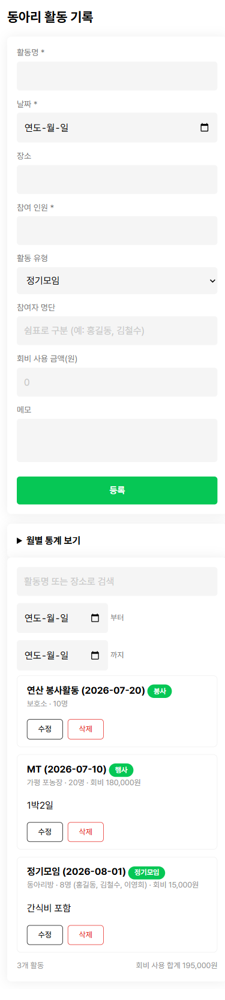

# 동아리 활동 기록 관리 웹앱

동아리 임원이 활동 내역을 **등록·조회·삭제**하고, 쌓인 기록을 **검색·통계**로 되짚어 볼 수 있는 웹앱.
프레임워크 없이 HTML / CSS / JavaScript 와 브라우저 `localStorage` 만으로 만들었다.

> 2026 해커톤 · **팀 02 시너지** (13:30–16:40, 실제 구현 시간 약 130분)
배포 링크 : https://yoochoyoon.github.io/hackathon--02--cho/

---

## 왜 만들었나

동아리 활동 기록은 보통 단톡방 공지나 개인 메모에 흩어진다. 학기가 끝나 활동 내역을
정리할 때가 되면 **어떤 활동을 언제 몇 명이 했는지 다시 모아야 한다.**

이 앱은 활동이 끝난 직후 그 자리에서 한 건을 등록해 두고, 학기 말에는 쌓인 목록을
검색·통계로 훑도록 만들었다. 즉 **등록은 짧고 자주, 조회는 몰아서** 일어나는 사용 흐름을
그대로 화면에 옮겼다.

---

## 기능

### 필수

| 기능 | 설명 |
|---|---|
| **활동 등록** | 활동명·날짜·장소·참여 인원·활동 유형·참여자 명단·회비 사용 금액·메모를 입력해 저장 |
| **활동 목록 조회** | 최신순 표시. 비어 있으면 안내 문구 |
| **활동 삭제** | 개별 삭제, 삭제 전 확인 절차 |
| **입력값 검증** | 활동명 필수 · 미래 날짜 불가 · 참여 인원 1 이상 정수 |

### 선택

| 기능 | 설명 |
|---|---|
| **활동 수정** | 등록한 활동을 불러와 고치기 |
| **기간 필터** | 시작일~종료일로 목록 좁히기 |
| **키워드 검색** | 활동명·장소를 실시간으로 거르기 |
| **월별 통계 차트** | 월별 활동 횟수 막대그래프. `<details>` 로 접어 둬 기본 화면은 목록에 집중 |
| **반응형 레이아웃** | 넓은 화면은 폼+통계 / 목록 2단, 좁은 화면은 세로 1열 |
| **활동 유형 태그** | 정기모임·행사·봉사·기타 중 선택, 목록 항목에 배지로 표시 |
| **참여자 명단** | 쉼표로 구분해 입력 (예: `홍길동, 김철수`), 목록 항목에 이름 나열 |
| **회비 사용 금액** | 활동별 금액 입력, 항목별 표시 + 현재 필터된 목록의 합계를 하단 상태 바에 표시 |
| **중복 등록 확인** | 같은 날짜·같은 활동명이 이미 있으면 등록 전에 확인창을 띄움 (수정 중인 항목 자신은 제외) |

---

## 실행 방법

서버·빌드·설치가 필요 없다. 저장소를 받아 `index.html` 을 브라우저로 열면 끝이다.

```bash
git clone https://github.com/Yoochoyoon/hackathon--02--cho.git
cd hackathon--02--cho
```

`index.html` 더블클릭 — 또는 로컬 서버로 열려면:

```bash
python -m http.server 8000
# 브라우저에서 http://localhost:8000
```

데이터는 브라우저 `localStorage` 의 `activities` 키에 남는다. 서버로 나가지 않는다.

---

## 화면

| 등록 폼과 검색 | 결과 없음 안내 |
|---|---|
|  |  |

**모바일(390px)** — 두 칸 폼이 한 칸으로 펴지고 차트·목록이 세로로 쌓인다.



---

## 설계에서 판단한 것들

**정렬 기준을 `date` 가 아니라 `createdAt` 으로 잡았다.**
지난 활동을 뒤늦게 입력하는 경우가 있는데, 활동 날짜순으로 세우면 방금 넣은 항목이
목록 중간에 묻혀 "저장이 됐나?" 싶어진다.

**등록 폼과 목록을 한 화면에 뒀다.**
활동이 끝난 직후 바로 적는 상황이라 화면을 옮겨 다니게 하면 등록이 번거로워진다.

**통계 차트에 외부 라이브러리를 쓰지 않았다.**
Chart.js 같은 CDN 을 붙일 수 있었지만, 네트워크가 막히면 시연 자체가 안 된다.
월별 막대그래프 정도는 `canvas` 로 직접 그리는 편이 안전하다고 봤다.

**검색이 목록 DOM 을 다시 만들지 않는다.**
`display` 만 건드려 걸러 낸다. 두 사람이 각각 `app.js`(목록 렌더)와 `features.js`(검색)를
맡았기 때문에, 검색이 목록을 재렌더하면 서로의 결과를 덮어쓴다.

**비주얼은 Apple 스펙을 버리고 LINE Design System 으로 갔다.**
처음엔 `getdesign` 카탈로그의 Apple 스펙(제품 마케팅 사이트 톤 — 80px 여백의 히어로,
명암 교차 풀블리드 섹션)을 그대로 입혔는데, 실제로 켜보니 활동 하나 등록하는 데
히어로 헤드라인이 있을 이유가 없었다. 대신 모바일 앱 컴포넌트 기반이라 밀도가 높고
"한 화면에 다 보이는" 걸 지향하는 LINE Design System(LDSG) 토큰(그린 `#06C755`,
opacity 기반 hover/press, 5·7px 라운드)으로 바꿨다. `DESIGN.md` 에 전체 스펙이 있다.

---

## 파일 구조

```
index.html      화면 구조
style.css       스타일 · 반응형
app.js          핵심 로직 — 등록/조회/삭제/수정/기간 필터/검증
features.js     차별화 기능 — 검색/월별 통계
CLAUDE.md       Claude Code 작업 규칙
DESIGN.md       비주얼 디자인 스펙 (LINE Design System 토큰 — 아래 참고)
docs/           계획·시간표·작업기록·보고서·스크린샷
```

활동 1건의 저장 형태:

```js
{
  id, title, date, place, memberCount, memo, createdAt,
  category,    // 활동 유형: 정기모임 | 행사 | 봉사 | 기타
  attendees,   // 참여자 명단, 문자열 배열 (선택)
  cost         // 활동에 사용한 회비 금액, 원 단위 (선택, 기본 0)
}
```

---

## 팀

| 이름 | GitHub | 맡은 곳 |
|---|---|---|
| 유초윤 | [@Yoochoyoon](https://github.com/Yoochoyoon) | `app.js` — 등록·조회·삭제·수정·기간 필터·입력값 검증·활동 유형/참여자 명단/회비/중복 등록 확인 |
| 신찬영 | [@scyscu153-byte](https://github.com/scyscu153-byte) | `style.css`, `features.js` — 검색·월별 통계·반응형, 보고서 작성 |

`index.html` 은 공동. 브랜치를 `feat/core` / `feat/ui` 로 나누고 **파일 소유권을 갈라**
같은 파일을 동시에 건드리지 않게 했다. 3파일짜리 앱에서 두 사람이 같은 파일을 만지면
병합 충돌 처리에 시간을 다 뺏기기 때문이다.

---

## 협업하며 겪은 것

두 사람이 **서로 다른 컴퓨터에서 동시에** 작업했고, `index.html` 이 나오기 전에
`features.js` 를 먼저 만들어야 했다. 그래서 검색·통계 쪽은 **필요한 요소가 나중에
생겨도 그때 붙도록** `MutationObserver` 로 DOM 을 지켜보게 짰다.

덕분에 두 브랜치를 합쳤을 때 접점(`#searchBox`, `#statsChart`, `data-activity-id`,
`window.Features.refresh()`)이 한 번에 맞물렸다.

다만 그 구조가 **버그도 하나 만들었다.** DOM 변화를 감시하면서 그 DOM 을 고치니
`textContent` 재기록 → mutation 감지 → 다시 재기록 으로 무한 재귀에 빠져,
검색창에 첫 글자를 넣는 순간 탭이 멈췄다. 통합 전에 목업으로 미리 돌려 봤기에
잡을 수 있었다 — 값이 실제로 바뀔 때만 쓰도록 고쳤다.

---

## 개발 도구

**Claude Code** 를 사용해 개발했다. 작업 규칙은 [`CLAUDE.md`](CLAUDE.md) 에 정리했고,
실제로 주고받은 프롬프트와 오류 해결 과정은 [`docs/작업기록.md`](docs/작업기록.md) 에 남겼다.
