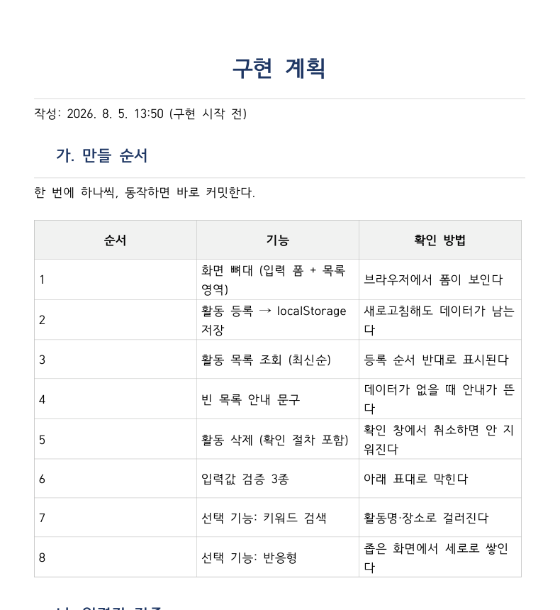

# 해커톤 결과 보고서

---

<!-- 개요 -->

팀 02 시너지 · 유초윤(app.js 핵심 기능) · 신찬영(style.css·features.js 차별화 기능, 보고서 작성)

저장소 github.com/Yoochoyoon/hackathon--02--- · 제출일 2026. 8. 5.

<!-- /개요 -->

## 문제 정의와 기획

동아리 활동 기록은 단톡방 공지나 개인 메모에 흩어진다. 학기 말에 정리하려면 어떤
활동을 언제 몇 명이, 얼마를 쓰며 했는지 다시 모아야 한다. 「동아리 활동 기록 관리
웹앱」은 활동을 등록하는 시점에 한곳에 쌓아 둔다. 주 사용자는 동아리 임원이며,
활동 직후 그 자리에서 한 건을 등록하고 학기 말에 몰아서 훑어본다.

- 필수 기능 3가지: 활동 등록 / 최신순 목록 조회(빈 목록 안내 포함) / 개별 삭제(확인 절차)
- 선택 기능: 활동 수정, 기간 필터, 키워드 검색, 월별 통계 차트, 반응형 레이아웃,
  활동 유형 태그, 참여자 명단, 회비 사용 금액, 중복 등록 확인. 검색·통계는 "조회는
  몰아서"에 맞물리고, 유형·참여자·회비는 학기 말 정리에서 되짚어보는 항목이라
  필드로 넣었다. 중복 등록 확인은 같은 활동을 두 번 입력하는 실수를 막는다.

## 설계

화면은 위에서부터 등록 폼 - 검색·기간 필터를 묶은 툴바 - 활동 목록 - 월별 통계
순서다. 통계는 부가 정보라 `
` 로 접어 기본 화면은 목록에 집중하게 했다.
등록 폼은 활동명·날짜·장소·참여 인원·활동 유형(정기모임/행사/봉사/기타)·참여자
명단·회비 사용 금액·메모를 받는다. 목록 항목에는 유형 배지·참여자·회비 금액이
함께 표시되고, 하단 상태 바에는 필터된 목록 건수와 회비 합계가 뜬다.

데이터는 `localStorage["activities"]` 에 배열로 저장한다. 필드는 `id, title,
date, place, memberCount, category, attendees, cost, memo, createdAt` 이다.
정렬을 `createdAt` 으로 한 이유 — 지난 활동을 뒤늦게 입력하면 날짜순으로는
방금 넣은 항목이 중간에 묻힌다. 같은 날짜·같은 활동명이 이미 있으면 등록 전에
확인창을 띄운다.

파일 구조는 `index.html`(화면) · `style.css`(스타일·반응형) · `app.js`(등록·조회·
삭제·수정·기간필터·검증·중복확인) · `features.js`(검색·월별 통계)다. 두 사람이
파일 소유권을 갈라 같은 파일을 동시에 건드리지 않게 했다.

## Claude Code 활용 과정

### CLAUDE.md

"한 번에 하나의 기능만", "동작하던 코드를 요청 없이 수정하지 않는다", "확실하지
않으면 추측하지 말고 질문한다"를 넣었다. 템플릿에 없는 "기록 규칙"도 추가했다 —
3장이 실제 프롬프트 원문을 요구하는데 기억으로 복원하면 꾸며진 내용이 된다.

### 구현 전 계획

계획과 달라진 점 — 스켈레톤 없이 각자 착수했다. `features.js` 가 필요한 요소를
`MutationObserver` 로 기다렸다 붙게 짜서 병합 접점이 맞물렸다. 통계 차트도
Chart.js(CDN) 대신 `canvas` 로 직접 그렸다.

### 핵심 프롬프트 3건

- "팀원이 깃헙 페이지 업데이트 했는데 나 (신찬영)부분 기능 구현 해야함. 아직
  html안올라왔는데, 나중에 틀 올라왔을때 바로 적용가능하게 해줘. 속도가 우선이니까
  기능 구현 병렬로 핼것" → `MutationObserver` 구조로 작성. 만족.
- "에이전트로 병렬로 처리하라니까" → 보고서 서식과 기능 검증을 별도 에이전트로
  동시 진행. 만족.
- "내가 생각한 보고서는 (블로그 주소) 이런 느낌이였는데.." → 본문 표만 읽고
  "A4 가로"로 오판, 예시 사진 확인 후 정정. 부분 만족.

### 프롬프트 개선 사례

처음 요청 — "일단 팀원이 클로드md정리와 기능 정하는 동안 내가 보고서 양식 정리하고
있을껀대". 화면 구성이 아스키 아트로 나와 PDF 에서 정렬이 무너졌다. "표나
플로우 정리는 아스키 아트가 아닌 머메이드js로 진행해야해" 로 고쳤다. Mermaid
흐름도로 바뀌었다. 배운 것 — 형식은 말로 명시해야 한다.

### 오류 해결 사례

검색창에 첫 글자를 넣는 순간 탭이 완전히 멈췄다. `applySearch()` 가 안내
문구의 `textContent` 를 값이 같아도 매번 다시 써, 그 변화를 `MutationObserver`
가 감지해 `refresh()` 를 다시 불러 무한 재귀에 빠졌다. 값이 실제로 바뀔 때만
쓰도록 해 해결했다. 배운 점 — DOM 을 감시하며 그 DOM 을 고치면 자기 자신을
다시 부른다.

## 실행 결과

검색어 "번개" 입력 시 해당 활동만 남고, 월별 통계가 막대로 표시된다(레이아웃
개편 전 캡처). 테스트 — 새로고침 후 데이터 유지, 최신순 정렬, 빈 목록 안내,
삭제 취소 시 미삭제, 필수값 미입력·미래 날짜 저장 차단을 확인했다. 콘솔 오류 없음.

## 한계와 개선 방향

- 시간 내 못 한 것: 사진 첨부, 데이터 JSON 내보내기/가져오기
- 불안한 부분: `localStorage` 는 기기마다 따로라 다른 PC 에서 열면 기록이 없다.
- 시간이 더 있었다면: 내보내기/가져오기부터 넣었을 것이다.

## 역할 분담과 소감

- 유초윤(app.js 전체 — 등록·조회·삭제·수정, 신규 필드): 필수 기능을 예상보다
  빨리 끝내서, 남은 시간에 TodoMVC·가계부 앱을 참고해 화면을 다시 짤 수
  있었다. 만드는 속도가 빨라진 만큼, 무엇을 만들지 정하는 쪽이 더 중요해졌다.
- 신찬영(style.css·features.js, 보고서 작성): 붙일 화면이 없는 상태에서 먼저
  기능을 만들어야 했는데, AI 에게 제약을 말하니 코드 구조로 옮겨 줬다. 다만
  그 구조가 무한 재귀 버그를 만들었고, 직접 돌려 보고서야 찾았다.
