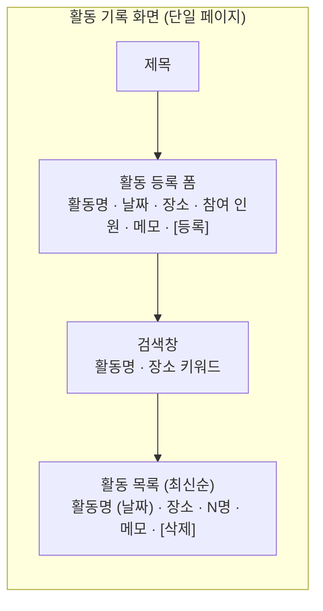
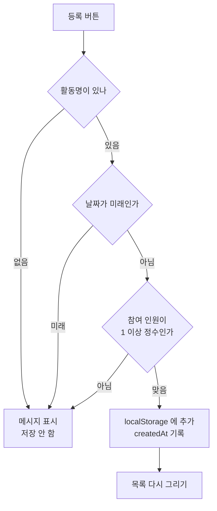

# 해커톤 결과 보고서

> **작성 안내 (제출 전 이 블록은 지운다)**
> - 채운 곳과 못 채운 곳을 `[ ]`로 표시해 뒀다. 전부 없앤 뒤 PDF로 바꾼다.
> - **3장은 `작업기록.md`에서 옮겨 온다. 기억으로 쓰지 않는다.**
> - 분량 2~4쪽. PDF 변환 후 쪽수를 반드시 확인한다.
>
> **서식 규칙 (한국 보고서 실무 관행)**
> - 항목 기호는 `□`(대분류) → `○`(중분류) → `―`(소분류) → `※`(참조) 순으로 쓴다.
>   `1. 가. 1)`은 공문서 번호 체계라 보고서에는 쓰지 않는다.
> - 날짜는 `2026. 8. 5.` 로 쓴다 (월·일 앞 0 생략, 마지막 마침표 포함).
> - 도표·흐름은 **Mermaid**로 그린다. 아스키 아트를 쓰지 않는다.

---

## 표지

| 항목 | 내용 |
|---|---|
| 팀번호 / 팀이름 | 02 / `[ ]` |
| 팀원 및 역할 | `[ ]` |
| GitHub 저장소 URL | https://github.com/Yoochoyoon/hackathon--02--- |
| 제출일 | 2026. 8. 5. |

---

## 1. 문제 정의와 기획

□ 이 웹앱이 해결하려는 문제

  동아리 활동 기록은 보통 단톡방 공지나 개인 메모에 흩어진다. 학기가 끝나고 활동
내역을 정리할 때가 되면 어떤 활동을 언제 몇 명이 했는지 다시 모아야 한다.
이 앱은 활동을 등록하는 시점에 한곳에 쌓아 두어, 나중에 찾아 헤매지 않게 한다.

□ 주 사용자와 사용 상황

  동아리 임원. 활동이 끝난 직후 휴대폰이나 노트북으로 그 자리에서 한 건을 등록한다.
학기 말에는 쌓인 목록을 훑어보며 정리한다. 즉 **등록은 짧고 자주, 조회는 몰아서**
일어난다.

□ 구현한 필수 기능 3가지

  ○ 활동 등록 — 활동명·날짜·장소·참여 인원·메모를 입력해 저장
  ○ 활동 목록 조회 — 최신순 표시, 빈 목록일 때 안내 문구
  ○ 활동 삭제 — 개별 삭제, 삭제 전 확인 절차

□ 구현한 선택 기능과 선택한 이유

`[ 구현 후 확정 — 계획은 키워드 검색 + 반응형 ]`

  ○ 키워드 검색: 학기 말에 목록이 길어지면 스크롤로 찾기 어렵다. 등록은 짧고 조회는
  몰아서 한다는 사용 상황에 검색이 직접 맞물린다.
  ○ 반응형: 활동 직후 그 자리에서 등록하는 상황이라 휴대폰 화면을 전제해야 한다.

---

## 2. 설계

□ 화면 구성

한 화면에 등록과 목록을 같이 뒀다. 활동이 끝난 직후 바로 적는 상황이라
화면을 옮겨 다니게 하면 등록이 번거로워진다.

□ 등록 처리 흐름

검증 세 가지를 모두 통과해야 저장한다. 어느 하나라도 걸리면 저장하지 않고
무엇이 잘못됐는지 화면에 알린다.

□ 데이터 구조

`localStorage`의 `"activities"` 키에 배열로 저장한다.

| 필드 | 뜻 |
|---|---|
| `id` | 활동 식별자. 저장 시각 기반. 삭제할 때 이 값으로 찾는다 |
| `title` | 활동명 (필수) |
| `date` | 활동 날짜. 미래 날짜 불가 |
| `place` | 장소 |
| `memberCount` | 참여 인원. 1 이상 정수 |
| `memo` | 메모 |
| `createdAt` | 등록 시각. 최신순 정렬 기준 |

정렬을 `date`가 아니라 `createdAt`으로 하는 이유: 지난 활동을 뒤늦게 입력하는
경우가 있어, 활동 날짜순으로 세우면 방금 넣은 항목이 목록 중간에 묻힌다.

□ 파일 구조

| 파일 | 역할 |
|---|---|
| `index.html` | 화면 구조 |
| `style.css` | 스타일 |
| `app.js` | 기능 로직 |
| `CLAUDE.md` | Claude Code 작업 규칙 |

---

## 3. Claude Code 활용 과정

### 3-1. 작성한 CLAUDE.md

□ 어떤 규칙을 넣었고, 왜 필요하다고 판단했는지

`[ 작업 후 채움 — 아래는 지금까지 확정된 것 ]`

  ○ **"한 번에 하나의 기능만 구현한다"** — 여러 기능을 한꺼번에 시키면 어디서 틀어졌는지
  못 찾는다. 기능 단위로 커밋하라는 과제 규칙과도 맞는다.
  ○ **"기존에 동작하던 코드를 요청 없이 수정하지 않는다"** — 되던 것이 깨지면 되돌리는
  데 시간을 뺏긴다. 3시간짜리 작업에서 가장 큰 위험이다.
  ○ **"확실하지 않은 부분은 추측하지 말고 먼저 질문한다"** — 추측으로 채운 코드는
  나중에 찾기 어렵다.
  ○ **"기록 규칙"(템플릿에 없는 항목을 직접 추가)** — 이 보고서 3장이 실제 입력한
  프롬프트 원문을 요구한다. 나중에 기억으로 복원하면 틀린 내용이 되므로,
  작업하면서 `docs/작업기록.md`에 그때그때 남기도록 규칙에 넣었다.

□ 작업 도중 규칙을 수정했다면 무엇을 왜 바꿨는지

`[ ] ← 수정할 때마다 작업기록.md 5번 표에 적어두고 여기로 옮긴다`

### 3-2. 구현 전 계획

□ 계획 화면 캡처

`[ docs/계획.md 를 화면 캡처해 삽입 ]`

□ 실제 작업이 계획과 달라진 부분

`[ ] ← 작업기록.md 4번에서 옮겨온다`

### 3-3. 핵심 프롬프트 3건

> **실제 입력한 문장 그대로 옮긴다. 요약하지 않는다.**

**① `[ ]`**

| 구분 | 내용 |
|---|---|
| 무엇을 요청했나 | `[ ]` |
| 어떤 결과를 받았나 | `[ ]` |
| 만족스러웠는지, 아니라면 왜 | `[ ]` |

**② `[ ]`**

| 구분 | 내용 |
|---|---|
| 무엇을 요청했나 | `[ ]` |
| 어떤 결과를 받았나 | `[ ]` |
| 만족스러웠는지, 아니라면 왜 | `[ ]` |

**③ `[ ]`**

| 구분 | 내용 |
|---|---|
| 무엇을 요청했나 | `[ ]` |
| 어떤 결과를 받았나 | `[ ]` |
| 만족스러웠는지, 아니라면 왜 | `[ ]` |

### 3-4. 프롬프트 개선 사례 1건

- 처음 요청한 내용: `[ ]`
- 결과가 기대와 달랐던 지점: `[ ]`
- 요청을 어떻게 고쳤는지: `[ ]`
- 고친 뒤 무엇이 달라졌는지: `[ ]`

### 3-5. 오류 해결 사례 1건

- 발생한 오류 (메시지 또는 증상): `[ ]`
- 원인 파악 과정: `[ ]`
- 해결 방법: `[ ]`
- 이 과정에서 배운 점: `[ ]`

---

## 4. 실행 결과

□ 주요 화면 스크린샷

`[ 2장 이상. 글자가 읽히는 크기로. 각 화면 설명을 붙인다 ]`

□ 테스트한 항목과 결과

| 항목 | 확인 내용 | 결과 |
|---|---|---|
| 활동 등록 | 새로고침 후에도 남는가 | `[ ]` |
| 목록 조회 | 최신순으로 표시되는가 | `[ ]` |
| 빈 목록 | 안내 문구가 뜨는가 | `[ ]` |
| 삭제 확인 | 취소하면 지워지지 않는가 | `[ ]` |
| 활동명 검증 | 비우면 저장이 막히는가 | `[ ]` |
| 날짜 검증 | 미래 날짜가 막히는가 | `[ ]` |
| 인원 검증 | 0과 소수가 막히는가 | `[ ]` |

---

## 5. 한계와 개선 방향

□ 시간 내 구현하지 못한 것: `[ ]`
□ 현재 코드의 문제점이나 불안한 부분: `[ ]`
□ 시간이 더 있었다면 무엇을 했을지: `[ ]`

---

## 6. 역할 분담과 소감

□ 팀원별 담당 업무

| 팀원 | 담당 |
|---|---|
| `[ ]` | `app.js` — 데이터·기능 로직, 테스트 |
| `[ ]` | `index.html`·`style.css` — 화면, 기록·보고서 |

□ AI를 활용한 개발에 대해 느낀 점

- `[ 팀원 1 — 한두 문장 ]`
- `[ 팀원 2 — 한두 문장 ]`
