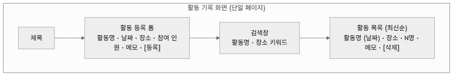
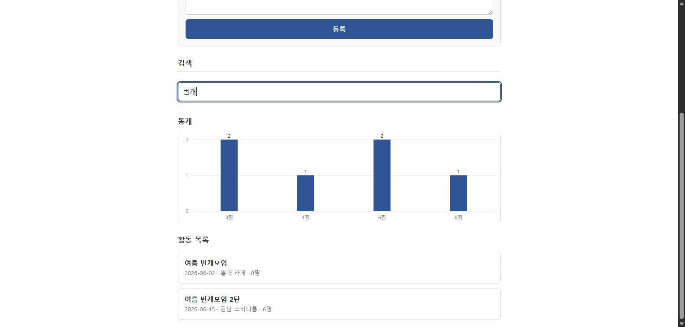

# 해커톤 결과 보고서

---

<!-- 개요 -->

팀 02 시너지 · 유초윤(app.js 핵심 기능) · 신찬영(style.css·features.js 차별화 기능)

저장소 github.com/Yoochoyoon/hackathon--02--- · 제출일 2026. 8. 5.

<!-- /개요 -->

## 문제 정의와 기획

**해결하려는 문제** — 동아리 활동 기록은 단톡방 공지나 개인 메모에 흩어진다. 학기 말에
정리하려면 어떤 활동을 언제 몇 명이 했는지 다시 모아야 한다. 이 앱은 활동을 등록하는
시점에 한곳에 쌓아 둔다.

**주 사용자** — 동아리 임원. 활동 직후 그 자리에서 한 건을 등록하고, 학기 말에 몰아서
훑어본다. 즉 **등록은 짧고 자주, 조회는 몰아서** 일어난다.

**필수 기능 3가지** — 활동 등록 / 최신순 목록 조회(빈 목록 안내 포함) / 개별 삭제(확인 절차)

**선택 기능** — 활동 수정, 기간 필터, 키워드 검색, 월별 통계 차트, 반응형 레이아웃.
검색과 통계는 "조회는 몰아서"라는 사용 상황에 직접 맞물리고, 반응형은 활동 직후
휴대폰으로 등록하는 상황을 전제해 골랐다.

## 설계

**화면 구성** — 등록 폼과 목록을 한 화면에 뒀다. 활동 직후 바로 적는 상황이라 화면을
옮겨 다니게 하면 등록이 번거로워진다.

**데이터 구조** — `localStorage["activities"]` 에 배열로 저장한다.
`{ id, title, date, place, memberCount, memo, createdAt }`

정렬을 `date` 가 아니라 `createdAt` 으로 한 이유: 지난 활동을 뒤늦게 입력하면 활동
날짜순으로는 방금 넣은 항목이 목록 중간에 묻혀 저장이 됐는지 알기 어렵다.

**파일 구조** — `index.html`(화면) · `style.css`(스타일·반응형) · `app.js`(핵심 로직) ·
`features.js`(검색·통계). 두 사람이 파일 소유권을 갈라 같은 파일을 동시에 건드리지
않게 했다.

## Claude Code 활용 과정

### 3-1. 작성한 CLAUDE.md

넣은 규칙과 이유 — **"한 번에 하나의 기능만"**(여러 개를 한꺼번에 시키면 어디서 틀어졌는지
못 찾는다) · **"동작하던 코드를 요청 없이 수정하지 않는다"**(되던 게 깨지면 되돌리는 데
시간을 뺏긴다) · **"확실하지 않으면 추측하지 말고 질문한다"**.

템플릿에 없는 **"기록 규칙"을 직접 추가**했다. 이 보고서 3장이 실제 입력한 프롬프트
원문을 요구하는데, 나중에 기억으로 복원하면 꾸며진 내용이 되기 때문이다.

### 3-2. 구현 전 계획

계획 화면: `[ docs/계획.md 캡처 삽입 ]`

**계획과 달라진 점** — "10분 안에 `index.html` 스켈레톤을 같이 만들고 각자 진행"할
예정이었으나, 실제로는 스켈레톤 없이 각자 착수했다. 차별화 기능 쪽은 붙일 화면이 없어,
`features.js` 가 필요한 요소를 `MutationObserver` 로 기다렸다 붙도록 짰다. 두 브랜치를
합쳤을 때 접점이 한 번에 맞물렸다. 통계 차트도 계획의 Chart.js(CDN) 대신 `canvas` 로
직접 그렸다 — 네트워크가 막히면 시연 자체가 안 되기 때문이다.

### 3-3. 핵심 프롬프트 3건

실제 입력한 문장 그대로다.

**①** "팀원이 깃헙 페이지 업데이트 했는데 나 (신찬영)부분 기능 구현 해야함. 아직
html안올라왔는데, 나중에 틀 올라왔을때 바로 적용가능하게 해줘. 속도가 우선이니까 기능
구현 병렬로 핼것"
→ 역할분담 문서를 먼저 읽어 담당 범위를 확인한 뒤, HTML 없이도 되도록
`MutationObserver` 구조로 두 파일 작성. **만족** — 제약을 코드 구조로 옮겼다.

**②** "에이전트로 병렬로 처리하라니까"
→ 보고서 서식과 기능 검증을 별도 에이전트로 동시 진행, 파일이 겹치지 않게 분리.
**만족** — 순차로 했으면 시간이 부족했다.

**③** "내가 생각한 보고서는 (블로그 주소) 이런 느낌이였는데.."
→ 처음엔 본문 표만 읽고 "A4 가로"로 잘못 판단. 예시 사진을 확인한 뒤 정정하고 제목
글상자를 반영. **부분 만족** — 링크만으로는 텍스트만 보고 단정하는 문제가 있었다.

### 3-4. 프롬프트 개선 사례

- **처음**: "일단 팀원이 클로드md정리와 기능 정하는 동안 내가 보고서 양식 정리하고 있을껀대"
- **달랐던 점**: 뼈대는 나왔으나 화면 구성이 **아스키 아트**로 그려졌다. 글꼴 폭이 안 맞으면
  정렬이 무너지고 PDF 에서 특히 심하다.
- **고친 요청**: "보고서에 들어가는 표나 플로우 정리는 아스키 아트가 아닌 머메이드js로
  진행해야해" — 출력 **형식을 명시**했다.
- **달라진 것**: Mermaid 흐름도로 바뀌었다. 다만 그대로 PDF 로 뽑으니 `flowchart TB …`
  문법이 본문에 평문으로 찍혀, 브라우저에서 렌더해 PNG 로 넣어 해결했다.

**배운 것**: 목적만 말하면 형식은 상대가 정한다. 형식이 중요하면 요청에 넣어야 한다.

### 3-5. 오류 해결 사례

- **증상**: 검색창에 첫 글자를 넣는 순간 **브라우저 탭이 완전히 멈췄다.** 오류 메시지는
  없었다. 함께 "일치하는 활동이 없습니다" 안내도 전혀 뜨지 않았다.
- **원인**: `index.html` 이 없어 목업을 만들어 직접 돌려 재현했다. `applySearch()` 가
  안내 문구의 `textContent` 를 조건 없이 매번 다시 쓰는데, **값이 같아도 텍스트 노드가
  교체되며 변경이 발생**한다. 그걸 `MutationObserver` 가 감지해 `refresh()` 를 다시 부르고,
  거기서 또 `textContent` 를 써서 무한 재귀에 빠졌다. 안내가 안 뜬 건 별개로,
  `style.css` 기본값이 `display:none` 인데 인라인 스타일을 `''` 로 지우기만 해서
  스타일시트의 `none` 으로 되돌아간 탓이었다.
- **해결**: 값이 실제로 바뀔 때만 쓰도록 해 재귀를 끊고, `display = 'block'` 을 명시했다.
- **배운 점**: **DOM 을 감시하면서 그 DOM 을 고치면 자기 자신을 다시 부른다.** "나중에
  붙게" 하려고 넣은 장치가 스스로 함정을 팠다. `display = ''` 는 "보이게"가 아니라
  "인라인 지정 제거"다. 통합 전에 목업으로 돌려 본 덕에 병합 후가 아니라 그 전에 잡았다.

## 실행 결과

검색어 "번개" 입력 시 해당 활동만 남고, 아래 월별 통계에 3월 2건·4월 1건·6월 2건·
8월 1건이 막대로 표시된다.
390px 폭에서는 두 칸 등록 폼이 한 칸으로 펴지고 차트·목록이 세로로 쌓인다(반응형 확인).

**테스트 결과** — 등록 후 새로고침해도 데이터 유지, 최신순 정렬, 빈 목록 안내 표시,
삭제 확인창 취소 시 미삭제, 활동명 미입력·미래 날짜·인원 0 입력이 각각 저장 차단됨을
확인했다. 콘솔 오류 없음.

## 한계와 개선 방향

- **시간 내 못 한 것**: 활동에 사진 첨부, 데이터 JSON 내보내기/가져오기
- **불안한 부분**: `localStorage` 는 브라우저·기기마다 따로라 다른 PC 에서 열면 기록이
  없다. 실제로 쓰려면 서버가 필요하다. 또 `features.js` 가 `MutationObserver` 로 DOM
  변화를 계속 지켜보므로, 항목이 아주 많아지면 부담이 될 수 있다.
- **시간이 더 있었다면**: 내보내기/가져오기를 먼저 넣었을 것이다. 기기가 바뀌면 기록이
  사라지는 것이 이 앱의 가장 큰 약점이다.

## 역할 분담과 소감

| 팀원 | 담당 |
|---|---|
| 유초윤 | `app.js` — 등록·조회·삭제·수정·기간 필터·입력값 검증 |
| 신찬영 | `style.css`·`features.js` — 검색·월별 통계·반응형 |

- 유초윤: `[ 한두 문장 ]`
- 신찬영: 붙일 화면이 없는 상태에서 먼저 기능을 만들어야 했는데, AI 에게 "나중에 틀이
  올라왔을 때 바로 적용 가능하게" 라고 제약을 말하니 그것을 코드 구조로 옮겨 줬다.
  다만 그 구조가 무한 재귀 버그를 만들었고, 그건 직접 돌려 보고서야 찾았다. 요청을
  잘 하는 것과 결과를 확인하는 것은 별개였다.
